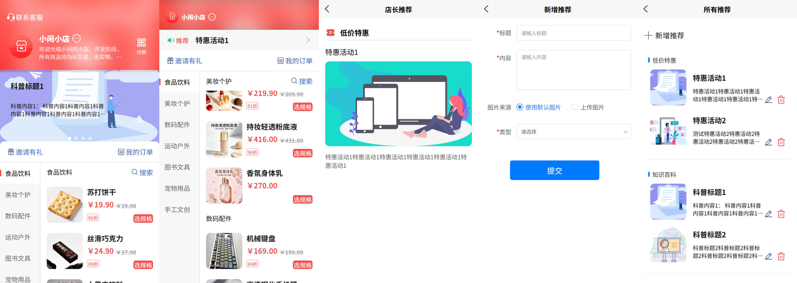
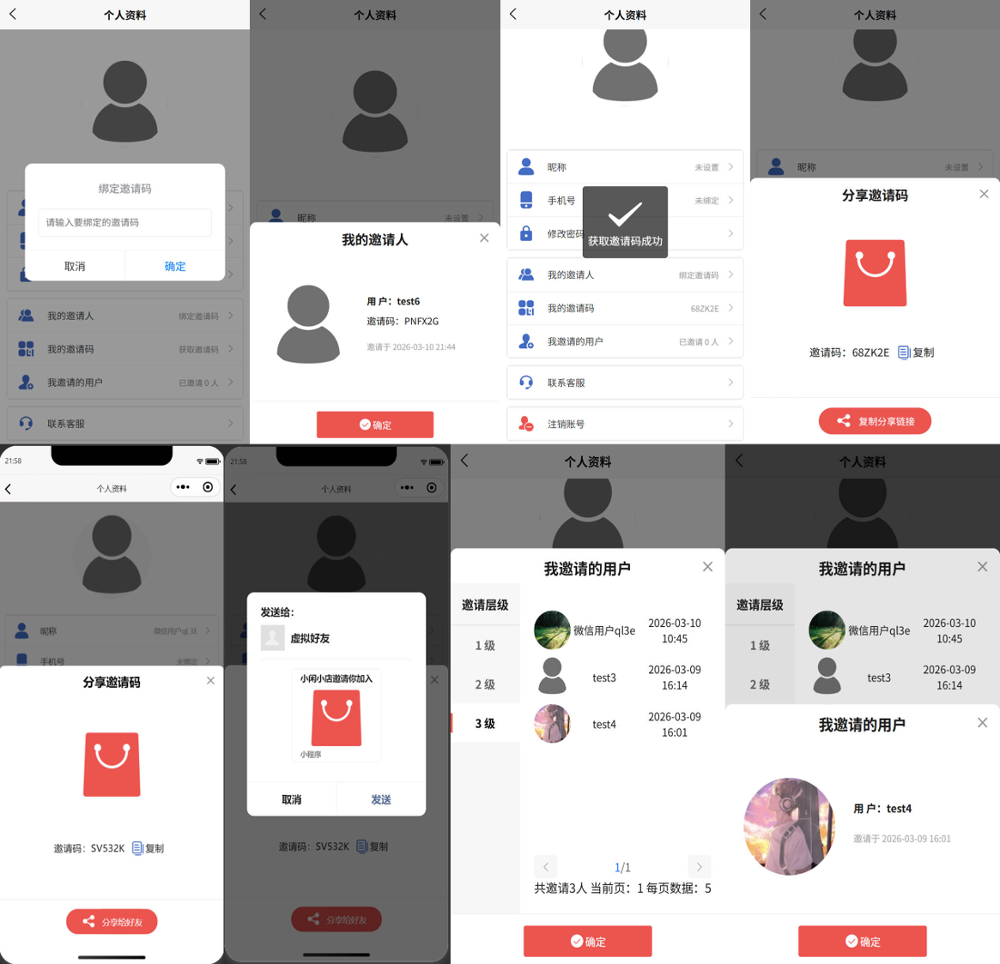
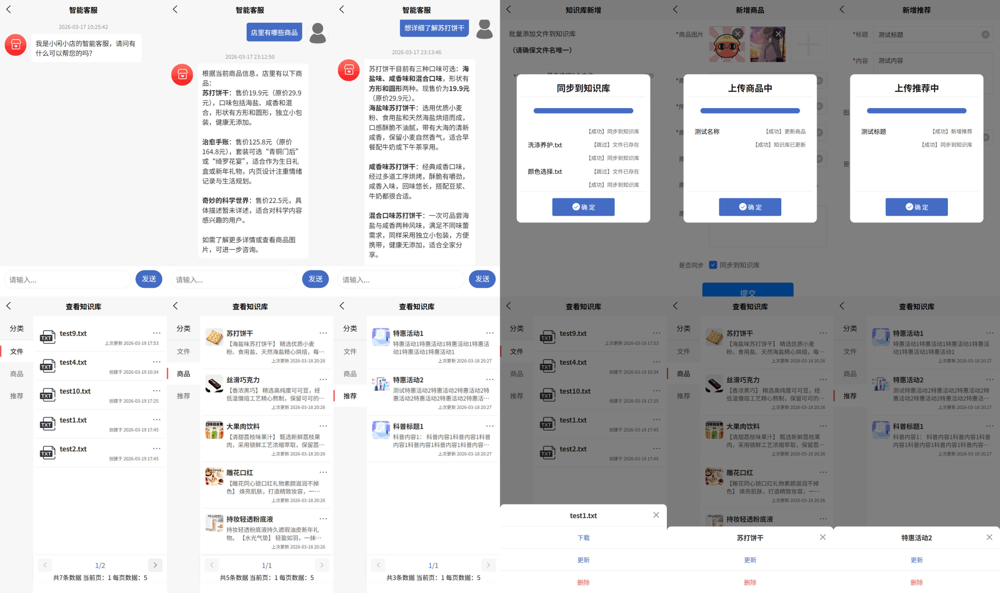

# 小闲小店 (XX-Mall)

一个基于 Uniapp + UniCloud 开发的跨端电商小程序/网页应用，支持智能客服功能。在[咸虾米 uniPay 商城](https://gitee.com/qingnian8/XXMuniPayMall)基础上新增轮播图 / 推荐管理、邀请裂变、智能客服功能。

## 项目简介

小闲小店是一款轻量级电商解决方案，采用前后端分离架构，可同时部署到微信小程序和 H5 网页端。项目集成了商品管理、订单系统、地址管理、智能客服等核心电商功能，并配备完整的后台管理系统。智能客服模块基于 RAG（检索增强生成）技术，支持知识库管理，为用户提供精准的商品咨询和导购服务。

- 演示地址：[https://yindongwen.top/demo/xxmall](https://yindongwen.top/demo/xxmall)

- 仓库地址：
  
    - [https://gitee.com/yindong-wen/xxmall](https://gitee.com/yindong-wen/xxmall)
    
    - [https://github.com/Yd-Wen/xxmall](https://github.com/Yd-Wen/xxmall)

- 项目截图

  - 店长推荐

  

  - 邀请裂变：我的邀请人、我的邀请码、我邀请的人

  

  - 知识库
    - 文件知识库：文件上传、下载、更新、删除后同步到知识库
    - 商品知识库：增删改查后同步到知识库
    - 推荐知识库：增删改查后同步到知识库

  

## 技术栈

### 前端
- **框架**: [Uniapp](https://uniapp.dcloud.net.cn/) (Vue2 语法)
- **UI 组件库**: [uView UI 2.0](https://uviewui.com/)
- **状态管理**: Vuex
- **身份认证**: uni-id-pages
- **支付功能**: uni-pay

### 后端
- **云服务**: UniCloud (阿里云版)
- **云函数**: Node.js
- **数据库**: MongoDB (uniCloud 云数据库)
- **智能客服后端**: FastAPI (独立部署，项目外)

### 部署平台
- 微信小程序
- H5 网页

## 项目结构

```
XX-Mall/
├── App.vue                     # 应用入口
├── main.js                     # 主入口文件
├── manifest.json               # 应用配置文件
├── pages.json                  # 页面路由配置
├── uni.scss                    # 全局样式变量
├── components/                 # 自定义组件
│   ├── cart-item/              # 购物车项组件
│   ├── goods-detail/           # 商品详情弹窗组件
│   ├── goods-item/             # 商品卡片组件
│   ├── goods-list/             # 商品列表组件
│   ├── goods-selection/        # 商品规格选择组件
│   ├── user-detail/            # 用户详情组件
│   ├── user-list/              # 用户列表组件
│   ├── xxm-banner/             # 轮播图组件
│   ├── xxm-cart/               # 购物车悬浮按钮组件
│   ├── xxm-delivery/           # 配送信息组件
│   ├── xxm-header/             # 页面头部组件
│   ├── xxm-numberbox/          # 数字输入框组件
│   ├── xxm-progress/           # 进度条组件
│   └── xxm-share/              # 分享组件
├── pages/                      # 用户端页面
│   ├── address/                # 地址管理 (列表、编辑)
│   ├── chatbot/                # 智能客服
│   ├── index/                  # 首页
│   ├── order/                  # 订单管理
│   ├── pay/                    # 确认订单/支付
│   ├── recommend/              # 店长推荐
│   └── search/                 # 商品搜索
├── pages_manage/               # 后台管理页面
│   ├── banner/                 # 推荐管理
│   ├── brand/                  # 商家信息
│   ├── category/               # 分类管理
│   ├── goods/                  # 商品管理
│   ├── index/                  # 管理后台首页
│   ├── knowledge/              # 知识库管理
│   ├── order/                  # 订单管理
│   └── type/                   # 推荐类型管理
├── store/                      # Vuex 状态管理
├── utils/                      # 工具函数
├── static/                     # 静态资源
├── uni_modules/                # uni-app 插件
│   ├── uni-config-center/      # 配置中心
│   ├── uni-id-common/          # 身份认证公共模块
│   ├── uni-id-pages/           # 身份认证页面
│   ├── uni-pay/                # 支付功能
│   └── uview-ui/               # uView UI 组件库
└── uniCloud-aliyun/            # UniCloud 阿里云版
    ├── cloudfunctions/         # 云函数
    │   ├── common/
    │   │   └── xxm-cloud-utils/    # 云函数公共工具
    │   ├── xxm-address/        # 地址相关 API
    │   ├── xxm-banner/         # 推荐相关 API
    │   ├── xxm-brand/          # 商家信息 API
    │   ├── xxm-category/       # 分类管理 API
    │   ├── xxm-goods/          # 商品管理 API
    │   ├── xxm-order/          # 订单管理 API
    │   ├── xxm-rag/            # 智能客服/知识库 API
    │   ├── xxm-sku/            # 商品规格 API
    │   └── xxm-type/           # 推荐类型 API
    └── database/               # 数据库 schema
        ├── xxm-category.schema.json
        ├── xxm-sku.schema.json
        ├── xxm-type.schema.json
        └── opendb-city-china.schema.json
```

## 功能特性

### 用户端功能
- **商品浏览**: 分类导航、商品列表、商品详情
- **搜索功能**: 关键词搜索商品
- **购物车**: 添加商品、数量调整、批量结算
- **订单系统**: 下单、支付、订单状态跟踪、订单详情
- **地址管理**: 收货地址的增删改查、默认地址设置
- **智能客服**: AI 驱动的商品咨询助手，支持多轮对话
- **邀请裂变**: 邀请码分享、邀请用户统计

### 管理后台功能
- **商品管理**: 商品的增删改查、图片上传、规格管理
- **分类管理**: 商品分类的增删改查、排序
- **订单管理**: 订单查看、状态管理
- **推荐管理**: 首页轮播图 / 店长推荐内容管理
- **知识库管理**:
  - 文件上传与同步到知识库
  - 商品信息同步到知识库
  - 推荐内容同步到知识库
  - 知识库文件下载、更新、删除
  - 知识库分类管理
- **商家信息**: 店铺基本信息配置

### 智能客服特性
- 基于 RAG 技术的知识库问答
- 支持商品信息智能检索
- 多轮对话支持
- 历史消息记录
- Markdown 格式 AI 消息渲染

## 部署步骤

### 环境要求
- [HBuilderX](https://www.dcloud.io/hbuilderx.html) 3.0+
- 微信开发者工具 (小程序部署)
- Node.js 16+

### 1. 克隆项目
```bash
git clone https://github.com/Yd-Wen/xxmall.git
cd xxmall
```

### 2. 导入项目
使用 HBuilderX 打开项目文件夹。

### 3. 配置 UniCloud
1. 登录 HBuilderX 账号
2. 右键 `uniCloud-aliyun` 文件夹 → 创建云服务空间
3. 右键 `uniCloud-aliyun/cloudfunctions` 中的云函数 → 上传部署
4. 右键 `uniCloud-aliyun/database` 中的 schema 文件 → 上传数据库

### 4. 配置小程序 (可选)
1. 在 [微信公众平台](https://mp.weixin.qq.com/) 注册小程序
2. 修改 `manifest.json` 中的 `mp-weixin.appid` 为你的小程序 AppID

### 5. 配置 H5 (可选)
1. 修改 `manifest.json` 中的 `h5.title` 为网站标题
2. 如需地图功能，配置 `h5.sdkConfigs.maps.amap` 中的高德地图 Key

### 6. 运行项目
- **微信小程序**: 点击 HBuilderX 菜单栏的「运行」→「运行到小程序模拟器」→「微信开发者工具」
- **H5**: 点击 HBuilderX 菜单栏的「运行」→「运行到浏览器」

### 7. 发布部署
- **微信小程序**: 点击「发行」→「小程序-微信」，然后在微信开发者工具中上传
- **H5**: 点击「发行」→「网站-H5手机版」，将生成的 `unpackage/dist/build/h5` 文件夹部署到服务器

## 更新日志

### 2026-03-30
- 🎉 **新增**: 新增云函数作为 agent 工具

### 2026-03-22
- 🎉 **新增**: 新增项目介绍

### 2026-03-19
- 🖍️ **优化**: 优化知识库更新逻辑
- 🎉 **新增**: 新增知识库页面布局
    - 新增更新知识库功能
    - 新增删除文件知识库的进度条显示
- ✨ **更新**: 统一各类知识库的操作选项 UI

### 2026-03-18
- 🖍️ **优化**: 优化进度条组件
    - 抽离公共方法到组件内部
    - 简化进度条组件设置
- 🎉 **新增**: 新增调用 RAG 云函数上传推荐数据到知识库
- 🎉 **新增**: 新增 RAG 云函数接口
    - 知识库查询接口调整为 POST 请求
    - 新增获取知识库分类接口
    - 新增文件下载接口
    - 新增文件删除接口
- ✨ **更新**: 更新知识库页面布局
    - 新增知识库删除功能
    - 新增知识库文件操作选项弹出层

### 2026-03-17
- 🖍️ **优化**: 优化进度条组件显示逻辑
- 🎉 **新增**: 新增调用 RAG 云函数上传商品数据到知识库
- ✨ **更新**: 更新 RAG 云函数调用逻辑

### 2026-03-16
- 🖍️ **优化**: 优化云函数
- ✨ **更新**: 更新 RAG 云函数调用逻辑
- 🎉 **新增**: 新增进度条组件
- 🖍️ **优化**: 优化知识库页面布局

### 2026-03-15
- 🖍️ **优化**: 优化工具类流式响应
- ✨ **更新**: 更新客服页面聊天框样式
- 🎉 **新增**: RAG 云函数

### 2026-03-14
- 🖍️ **优化**: 优化客服页面流式传输
- ✨ **更新**: 更新工具类：兼容流式传输和非流式响应

### 2026-03-13
- 🎉 **新增**: 新增客服页面
- 🎉 **新增**: fastapi 接口与 AI 对话功能

### 2026-03-12
- ✨ **更新**: 更新 token 失效的提示信息
- ✨ **更新**: 新增微信小程序端邀请人信息提示

### 2026-03-11
- ⛔ **删除**: 删除最大邀请人数限制
- ✨ **更新**: 更新绑定邀请码时超出邀请层级限制的逻辑，见[邀请链长度检查方案](./20260312)

### 2026-02
- 🎉 **新增**: 新增智能客服功能 (基于 RAG)
- 🎉 **新增**: 新增知识库管理模块
- ➕ **集成**: 集成商品/推荐内容与知识库同步
- 🎉 **新增**: 新增邀请裂变功能
- 🎉 **新增**: 新增用户列表和用户详情组件

### 2026-01
- 🥇**项目初始化** : 项目初始化
- ✨ **更新**: 完成基础电商功能 (商品、订单、支付、地址)
- ✨ **更新**: 完成后台管理系统基础功能
- ➕ **集成**: 集成 uni-id-pages 身份认证
- ➕ **集成**: 集成 uni-pay 支付功能

## 开源协议

本项目基于 [MIT License](./LICENSE) 开源。

Copyright (C) 2026 - present by Yd Wen

## 作者

- **Yd Wen** 
  - [GitHub](https://github.com/Yd-Wen)
  - [Gitee](https://gitee.com/yindong-wen)
  - [个人主页](https://yindongwen.top)

## 致谢

- [咸虾米 uniPay 商城](https://gitee.com/qingnian8/XXMuniPayMall) - 布局篇
- [DCloud](https://www.dcloud.io/) - Uniapp 和 UniCloud
- [uView UI](https://uviewui.com/) - UI 组件库
- [uni-id-pages](https://ext.dcloud.net.cn/plugin?id=8577) - 身份认证插件
- [uni-pay](https://ext.dcloud.net.cn/plugin?id=1835) - 支付插件
